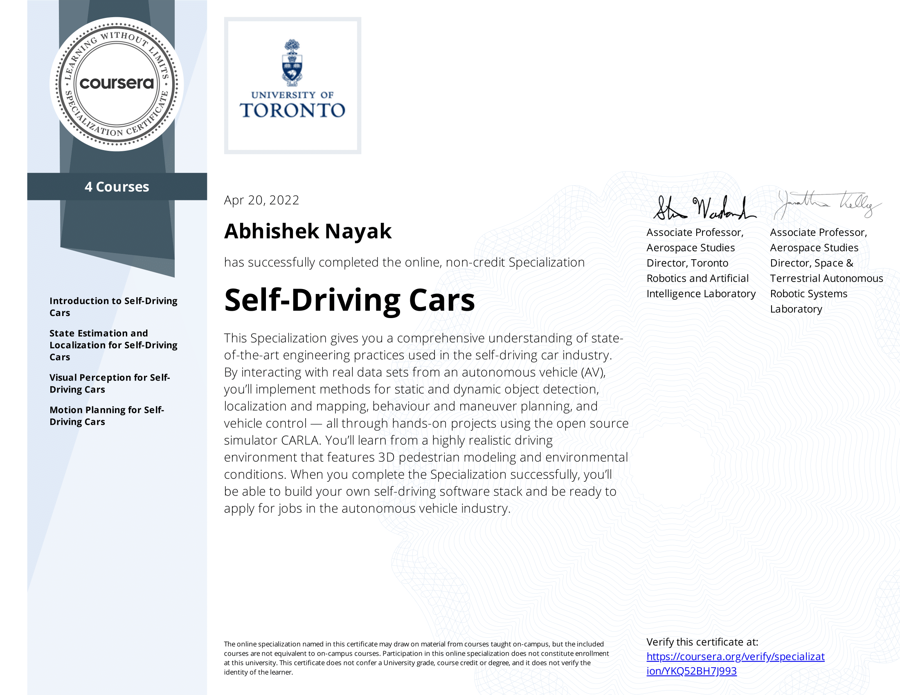

# Coursera Self-Driving Cars Specialization
Projects from the Self Driving Cars Specialization offered by University of Toronto on Coursera

## Content

- [Introduction to Self-Driving Cars](./course_1)
- [State Estimation and Localization for Self-Driving Cars](./course_2)
- [Visual Perception for Self-Driving Cars](./course_3)
- [Motion Planning for Self-Driving Cars](./course_4)
## Certificate

